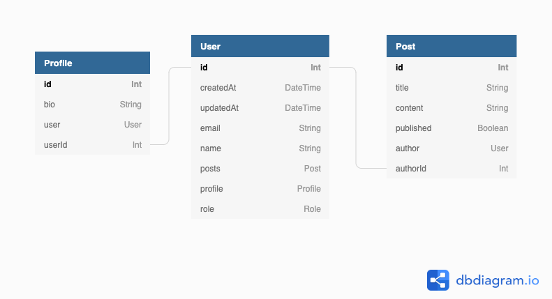

# Prisma DBML Generator

Automatically generate a [DBML](https://www.dbml.org/home) schema from your Prisma Schema. Updates every time `npx prisma generate` runs. Use [dbdiagram.io](https://dbdiagram.io/home) to visualize your `dbml` files:



## Getting started

1. Install this generator:

```bash
npm install -D prisma-dbml-generator
```

2. Add the generator to the `schema.prisma`

```prisma
generator dbml {
  provider = "prisma-dbml-generator"
}
```

3. Running `npx prisma generator` for the following Prisma schema

```prisma
model User {
  id        Int      @id @default(autoincrement())
  createdAt DateTime @default(now())
  updatedAt DateTime @updatedAt
  email     String   @unique
  name      String?
  posts     Post[]
  profile   Profile?
  /// user role
  role      Role
}

/// User profile
model Profile {
  id     Int     @default(autoincrement()) @id
  bio    String?
  user   User    @relation(fields: [userId], references: [id])
  userId Int     @unique
}

model Post {
  id        Int     @id @default(autoincrement())
  title     String
  content   String?
  published Boolean @default(false)
  author    User?   @relation(fields: [authorId], references: [id])
  authorId  Int?
}

/// user role
enum Role {
  ADMIN /// allowed to do everything
  USER
}
```

generates the following `schema.dbml` in `prisma/docs`

```dbml
Table User {
  id Int [pk, increment]
  createdAt DateTime [default: `now()`, not null]
  updatedAt DateTime [not null]
  email String [unique, not null]
  name String
  posts Post
  profile Profile
  role Role [not null, note: 'user role']
}

Table Profile {
  id Int [pk, increment]
  bio String
  user User [not null]
  userId Int [unique, not null]

  Note: 'User profile'
}

Table Post {
  id Int [pk, increment]
  title String [not null]
  content String
  published Boolean [not null, default: false]
  author User
  authorId Int
}

Enum Role {
  ADMIN
  USER
}

Ref: Profile.userId - User.id

Ref: Post.authorId > User.id
```

4. [Visualize](https://dbdiagram.io/d) the `schema.dbml`

## Development

```bash
npm run dev
```

## Helpful

[Prisma Generator](https://github.com/prisma/specs/tree/master/generators)